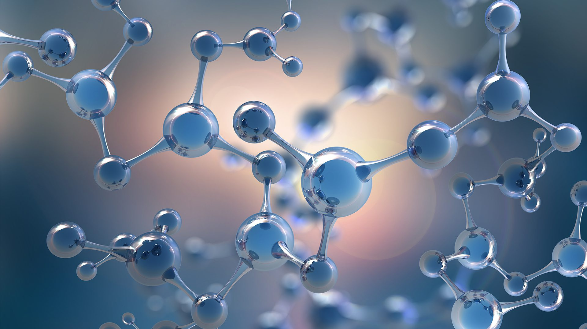
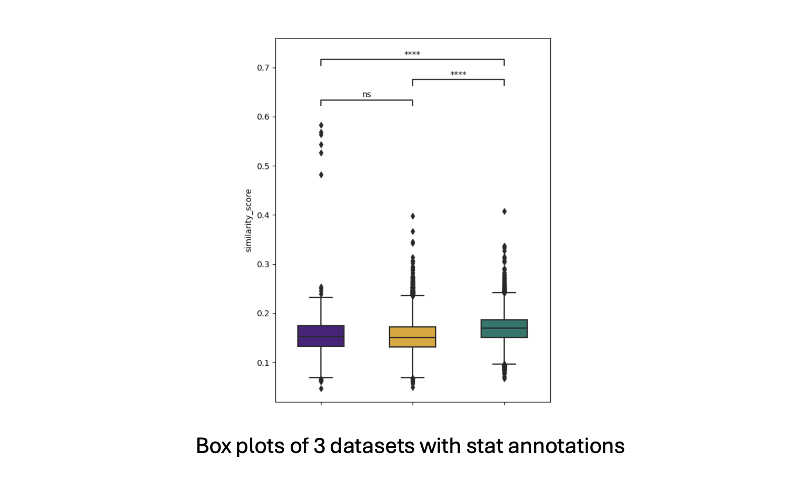
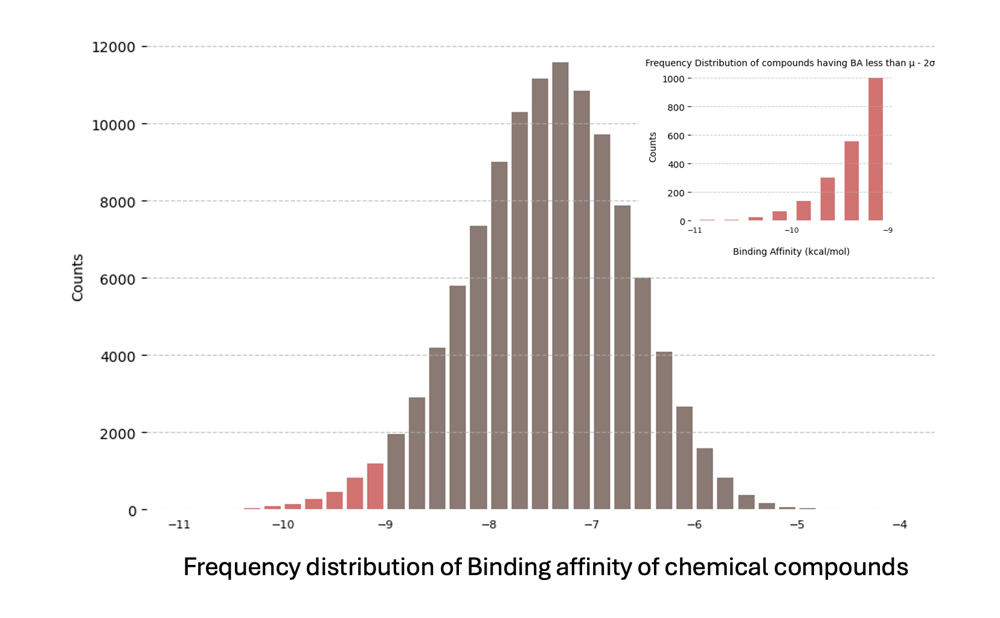
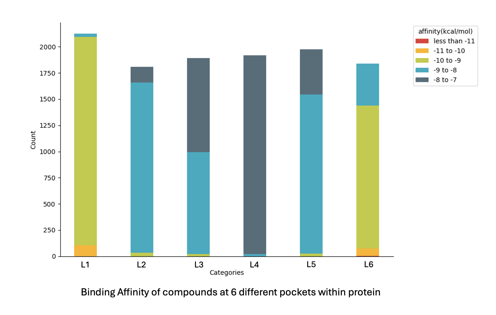
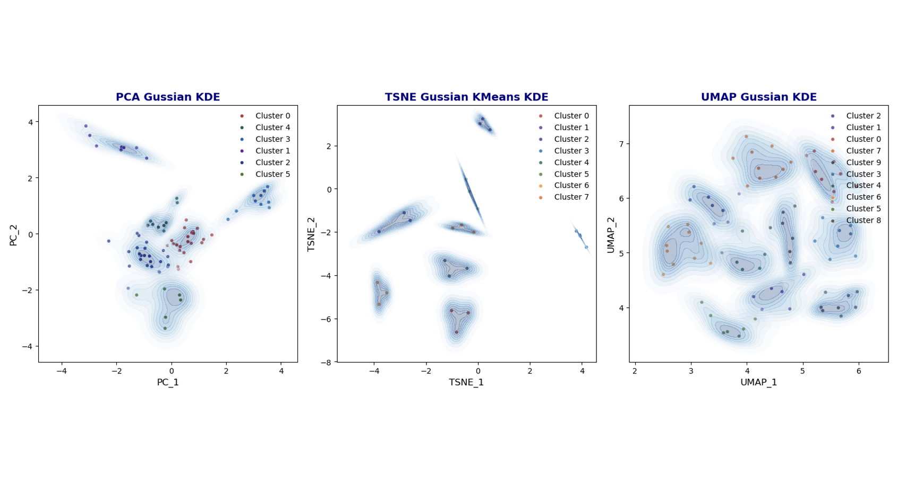

# Chemical Data Analysis and Visualization

This project involves data analysis and visualization of chemical compound data using Python libraries like Pandas, RDKit, Matplotlib, Seaborn, and PIL. It includes Jupyter notebooks for creating box plots, histograms, stacked bar plots, clustering analysis, and image collages. Docker is used for environment setup, ensuring reproducibility. Users can preprocess data, compute molecular fingerprints, apply dimensionality reduction, perform clustering, and visualize results, with all figures saved in the figures directory.

## Project Structure

- `Makefile`: Scripts to build and manage Docker containers.
- `devops`: Directory containing Docker configurations.
  - `docker-compose.yml`: Docker Compose configuration file.
  - `jupyterlab`: Contains Dockerfile and environment configuration for JupyterLab.
- `main`: The main directory contains Jupyter notebooks for various data analysis and visualization tasks, and additional directories for data and figures.
  - `1_Box_plot_with_statannotation.ipynb`: Notebook for creating box plots with statistical annotations.
  - `2_histogram.ipynb`: Notebook for creating histograms.
  - `3_stacked_bar_plots.ipynb`: Notebook for creating stacked bar plots.
  - `4_clustering.ipynb`: Notebook for clustering analysis.
  - `5_collage_images.ipynb`: Notebook for creating image collages.
  - `data`: Directory containing datasets used in the analysis.
  - `figures`: Directory for storing generated figures and visualizations.

## Docker Setup and Usage
Note: Make sure you have Docker installed on your system.
1.  Clone the repository to your local machine: `git clone git@github.com:KailashLohar/Comp-Chem-Analytics.git`

2.  Navigate to the project directory "**Comp-Chem-Analytics**" and run the following commands to build the Docker image :`make build-image`

3.  Start the container using command: `make start-container`
Access the container from remote machine webpage using [own5](https://own5.aganitha.ai:8543/)

4.  Enter the Container using command: `make enter-container`

5.  Stop the Container using command: `make stop-container`

## Instruction for using Notebooks
Once you are inside Jupyterlab container, you try out different notebooks. Explanation of each notebooks are given below.

###  Explanation of "1_Box_plot_with_statannotation.ipynb":

1. The code reads a CSV file into a DataFrame, processes the data to compute similarity scores between pairs of molecules using RDKit and Morgan fingerprints, and returns a new DataFrame with these scores.

2. It then creates a box plot to visualize the similarity scores for different datasets using Seaborn, and configures the plot with specific colors and labels.

3. The code annotates the box plot with statistical test results (Mann-Whitney) to compare pairs of datasets, and saves the final plot as an image file (box_plot.png).

###  Explanation of "2_histogram.ipynb":

1. The code defines a function to display color palettes using Matplotlib, iterates through color shades in the material dictionary to generate palettes, and ensures the figures directory exists.

2. It reads a CSV file containing binding affinity data, displays the data's first few rows and shape, and defines a function to plot and save a histogram of binding affinities, highlighting a specific range.

3. Another CSV file is read for compounds with binding affinities below a threshold, the data is displayed, and a similar plotting function is used to create and save a histogram for these specific affinities, with highlighted bins.

###  Explanation of "3_stacked_bar_plots.ipynb":

- The code reads multiple CSV files from a specified directory, concatenates them into a single DataFrame, adds a 'TAG' column based on file names, categorizes the 'Affinity' values into defined ranges, creates a crosstabulation of 'TAG' against 'affinity' categories, and plots a stacked bar chart showing the distribution of affinities across different conformers, saving the plot as an image file.

###  Explanation of "4_clustering.ipynb":

1. The code reads a CSV file into a DataFrame, renames columns, filters rows based on specific tags, and computes molecular fingerprints for each molecule using RDKit, converting them into numpy arrays.

2. It applies PCA (Principal Component Analysis), t-SNE (t-distributed Stochastic Neighbor Embedding), UMAP (Uniform Manifold Approximation and Projection) simulatanelusly for dimensionality reduction on the fingerprint data, creating a new DataFrame with the PCA results, including the original tags and SMILES strings, and visualizes the PCA results with a scatter plot.

3. The code uses the Elbow Method to determine the optimal number of clusters for KMeans clustering by plotting the Within-Cluster Sum of Squares (WCSS) and the slope of WCSS values for different numbers of clusters, then performs KMeans clustering on the PCA data.

4. It visualizes the clustered PCA, t-SNE and UMAP data simultaneously using scatter plots and KDE (Kernel Density Estimation) plots, highlighting different clusters with distinct colors and alphas, and saves these visualizations as image files.

###  Explanation of "5_collage_images.ipynb":

1. The code horizontally stacks two images (1.png and 2.png) with a 2-pixel border between them using the PIL library. It calculates the total width and maximum height for the collage, creates a new image with these dimensions, and pastes the individual images side by side, adding black borders between them, and then displays the collage.

2. The code vertically stacks two images (2B.png and 2D.png) with a 5-pixel border between them using the PIL library. It calculates the maximum width and total height for the collage, creates a new image with these dimensions, and pastes the individual images on top of each other, and then displays the collage.

## Author

- Kailash Lohar  <kailashlohariitkgp@gmail.com>

## License

This project is licensed under the MIT License - see the LICENSE file for details.
